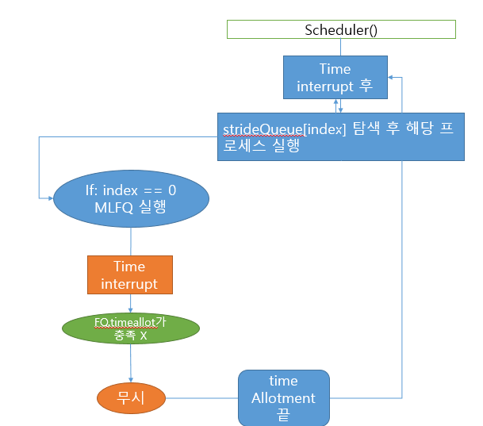
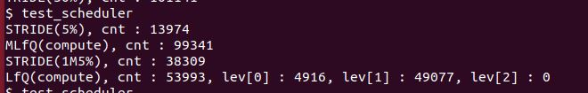
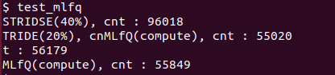

# OS_Project01

#  MLFQ and Stride scheduling


### Design of MLFQ and Stride


+ MLFQ

  - MLFQ는 3개의 큐을 가지고 있는 배열로 FQ0 ~ FQ2를 가집니다. feedback Queue 구조체는 아래와 같습니다.

    ```
    struct FQ{
    	int totalCount;
    	int timeAllotment;
    	int currentPosition;
    	struct proc* holdingProcess[NPROC]
    }
    ```

  - 각 FQ들은 우선순위에 따라 다른 time quantum과 time allotment를 가집니다.

    > FQ2 | time quantum: 1tick, time allotment: 5tick
    >
    > FQ1 | time quantum: 2tick, time allotment: 15tick
    >
    > FQ0 | time quantum: 4tick, time allotment: 가능한만큼(다른 우선순위가 없으면 계속 진행)

  - Starvation을 막기 위해 `boostPriority`함수를 통해 100tick당 한번 씩 FQ0, FQ1의 process들을 FQ2로 옮깁니다.

+ Stride

  + 모든 프로세스는 set_cpu_share을 호출하는 순간 MLFQ에서  strideQueue로 이동합니다. 또한 stride 구조체가 process를 감싸면서 원하는 cpu time share percent에 비례한 stride 값과 pass값 position (strideQueue내에서의 자신의 위치)등을 갖게 됩니다.
  + stride schedule을 통한 cpu time은 80%가 넘지 않게 하기위해 20%에 해당되는 stride를 strideQueue[0]에 부여합니다. strideQueue[0]는 MLFQ를 실행하기 위한 stride와 pass값을 저장하는 곳입니다.

  + Stride 구조체 배열은 스케쥴이 돌면서 minPass값을 가진 process를 찾습니다. 찾으면 해당 프로세스를 실행시킵니다. Stirde 구조체는 아래와 같습니다.

  ```
  struct stride{
  	int stride
  	int pass
  	int timeSharePercent
  	int position
  	struct proc* proc;
  }
  ```

  

- scheduler 기본 동작 원리

제일 처음 `scheduler` 함수가 동작하면 findMinPass를 통해 stride 큐에서 pass가 가장 낮은 queue를 찾습니다. 그 후 작업을 진행 한 뒤, 해당 프로세스의 pass에 stride만큼 추가 해줍니다. 만약 minPass가 strideQueue에서 0 번째 해당하는 큐라면 MLFQ 스케쥴러를 실행합니다. 전체의 20%에 해당하는 Stride를 0번째 StrideQueue(MLFQ)에 부여합니다. 이는 MLFQ의 CPU-Time을 최소 20% 지키기 위해서 입니다.


 MLFQ의 process는 실행이 되면, `checkTimeAllotment` 함수를 통해 time interrupt가 일어나도 MLFQ에서 뽑힌 process에 FQ level에 맞는 time allotment만큼 실행되는 것을 보장해줍니다.

이를 그림으로 설명하면 아래와 같은 방법이 됩니다.


# Scheduling scenario


### test case 1

yield가 없는 mlfq, stride가 혼합된 코드를 돌릴 경우입니다(`test_scheduler.c`).

>133		// Process scheduled by Stride scheduler, use 5% of CPU resources 
>134         {test_stride, 5},
>135         /* Process scheduled by Stride scheduler, use 15% of CPU resources *
>136         {test_stride, 15},
>137         /* Process scheduled by MLFQ scheduler, does not yield itself */
>138         {test_mlfq, MLFQ_NONE},
>139         /* Process scheduled by MLFQ scheduler, does not yield itself */
>140         {test_mlfq, MLFQ_NONE},


stride는 최소 5%, 15%를  보장받으며, mlfq또한 최소 20%를 보장 받습니다. 

만약 MLFQ와 stride가 100%를 꽉 채우지 못할경우 mlfq와 추가적으로 cpu를 할당합니다.



+ stride 5%: 13974 -> 6.7%
+ stride 15%: 38309 -> 18.6% 
+ mlfq levcnt: 53993 -> 26.2%
+ mlfq cnt: 99341 -> 48.3%
+ total: 205617

이렇듯 최소 5%와 15% 모두 잘 지키고 있으며, 추가적인 CPU는 mlfq에 들어갔다는 것을 확인할 수 있습니다.

### testcase 2

yield가 없는 mlfq(levcnt 없이), stride가 혼합된 코드를 돌릴 경우입니다(`test_mlfq.c`).



+ stride 20%: 56179 -> 21.3%
+ stride 40%: 96018 -> 36.4% 
+ mlfq cnt: 55020 
+ mlfq cnt: 55849 
+ total: 263066


40%에서 원하는 비중보다 조금 낮습니다. 한 stride가 share 40% 이상 올라 갈 수록 점유하는 시간이 많아서 일찍 반환하고 그만큼 mlfq가 사용하여 아마 차이가 생긴것으로 추정됩니다.

### testcase 3

stride만의 코드를 돌릴 경우입니다(`test_stride.c`).


+ stride 05%: 18698 -> 07.2%
+ stride 15%: 52230 -> 20.2%
+ stride 25%: 86034 -> 33.3%
+ stride 35%: 101141 -> 39.1%
+ total: 258098

stride만 돌릴경우 `stride_arr[0](mlfq가 선택될 때)`가 비어져 있으며 이때, 돌릴게 아무것도 없으면 다시 stride_arr[1]부터 순회하여 low pass를 찾습니다. 따라서 골고루 할당 %가 오른 모습입니다.